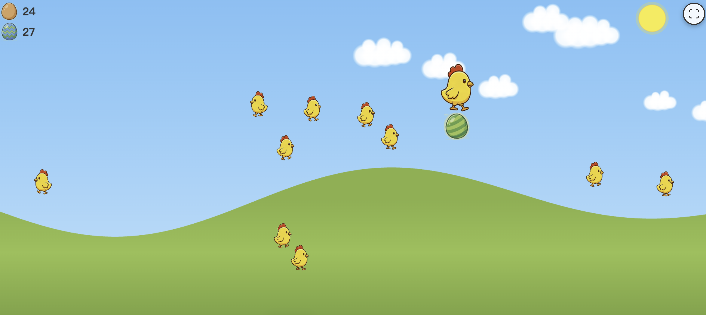

# 快乐小鸡 - 幼儿浏览器游戏

一款专为 2–5 岁儿童设计的简单点击游戏。点击屏幕，大鸡会跑到该位置并在脚下下蛋；蛋经历出现 → 晃动 → 破裂后孵出小鸡，小鸡会自动走向屏幕一侧并消失。

## 运行方式
浏览器打开 game/index.html



## 游戏特色

- ✅ **即时反馈**：点击后大鸡立即朝该位置移动，到达后下蛋
- ✅ **完整动画**：大鸡行走 → 下蛋 → 蛋出现 → 晃动 → 破裂 → 孵出小鸡 → 小鸡行走离场
- ✅ **彩蛋惊喜**：50% 概率为彩蛋，7 种样式（蓝、粉、橙、绿、紫、黄、浅蓝）
- ✅ **记分显示**：左上角显示普通蛋与彩蛋数量（图标 + 数字）
- ✅ **多点触控**：支持最多 5 个手指同时点击
- ✅ **无限游戏**：无输赢、无结束，可一直玩
- ✅ **音效反馈**：母鸡下蛋声（chick_3s.mp3 前 2 秒）、蛋壳破裂声（egg.mp3 前 2 秒），与动画同步
- ✅ **高饱和度色彩**：明亮原色，适合幼儿视觉

## 认知科学设计

- **因果关系**：强化「点击 → 大鸡跑来 → 下蛋 → 孵出小鸡」的因果链
- **手眼协调**：锻炼精细动作与目标点击
- **客体追踪**：通过大鸡与小鸡的移动训练视觉追踪
- **情绪调节**：无挫折机制，正向反馈
- **变率强化**：彩蛋随机出现，维持探索兴趣

## 使用方法

1. 在浏览器中打开 `index.html`（可直接双击打开，无需启动服务器）
2. 点击屏幕任意位置，大鸡会跑到该处并在脚下下蛋
3. 等待蛋出现、晃动、破裂，小鸡会自动孵出并走向一侧消失
4. 左上角可查看普通蛋与彩蛋数量
5. 继续点击即可持续游玩

## 技术实现

- **纯前端**：HTML + CSS + JavaScript，无后端
- **Canvas 绘图**：`eggs.png`（8 枚蛋）、`chickens.png`（4 帧小鸡）精灵图，`drawImage` 绘制
- **音效**：通过 `<audio>` 标签加载 `chick_3s.mp3`、`egg.mp3`，与图片一样从当前目录加载，**支持 file:// 直接打开**，无需 Web 服务器
- **Web Audio API**：蛋出现/晃动/小鸡叫声等短音由振荡器合成
- **响应式**：适配移动端与桌面端
- **家长设置**：输入 `P-A-R-E-N-T` 可打开隐藏设置（音效、自动全屏、重置）

## 浏览器兼容性

- Chrome / Edge（推荐）
- Safari
- Firefox

## 家长设置

在页面上按顺序输入 `P-A-R-E-N-T` 可打开隐藏设置面板：

- 开启/关闭音效
- 开启/关闭自动全屏
- 重置游戏（清除所有鸡蛋与小鸡）

## 项目结构

```
HappyChiken/
├── index.html       # 主页面
├── styles.css       # 样式
├── game.js          # 游戏逻辑（Canvas、多点触控、音效）
├── eggs.png         # 蛋精灵图（8 枚）
├── chickens.png     # 小鸡精灵图（4 帧）
├── chick_3s.mp3     # 母鸡下蛋声（播放 0–2s）
├── egg.mp3          # 蛋壳破裂声（播放 0–2s）
├── raw-pics/        # 原始素材与剪辑脚本
│   ├── clip_audio.sh
│   ├── chick.mp3, egg.wav
│   └── ...
├── RDA.md           # 需求文档
└── README.md        # 本说明
```

## 核心功能简述

1. **点击 → 下蛋**：点击后大鸡移动到该位置，到达后在脚下生成一枚蛋（普通或彩蛋）。
2. **彩蛋系统**：50% 概率为彩蛋，7 种类型对应 7 种蛋面与孵出的小鸡样式。
3. **记分**：左上角分别统计普通蛋、彩蛋数量。
4. **音效**：下蛋时播放母鸡叫声（前 2 秒），破壳时播放蛋壳破裂声（前 2 秒）；其余短音为合成音效。
5. **多点触控**：最多 5 个触点同时有效，每个触点可独立触发一次「移动 + 下蛋」。

## 开发说明

- 所有点击都视为有效，无错误惩罚
- 音效与图片均从当前目录加载，可直接打开 `index.html` 使用
- 无数据收集、无广告、无外链
- 面向 2–5 岁儿童的认知与操作习惯设计

## 许可证

本项目仅供学习与娱乐使用。
